# methak

An application that provides several legal, sports, health, etc. services, with the ability to communicate with lawyers, doctors, nutritionists, etc., and the ability to book an appointment for consultation. 

## packages
 state management ( cubit )
 dependencies (ger_it )
 network (switch  dio & http),
 clean architecture
 firebase 
 flutter_localizations

## Screen
 
 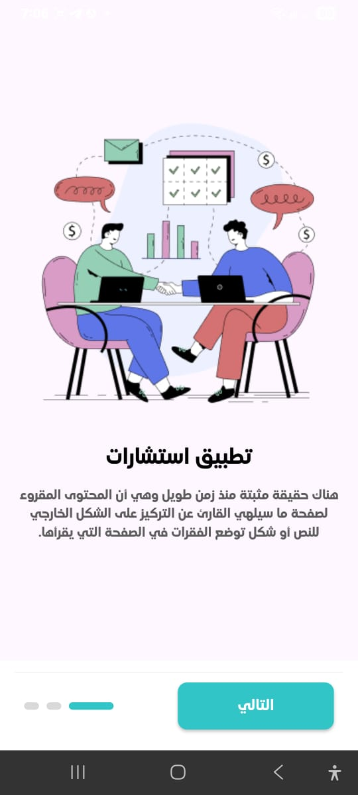
 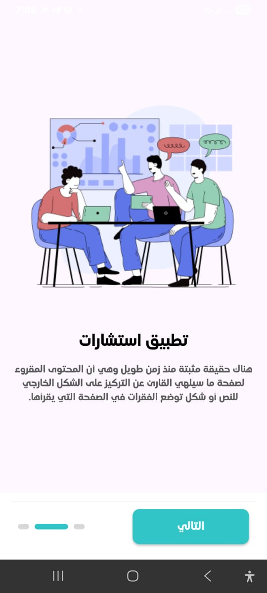
 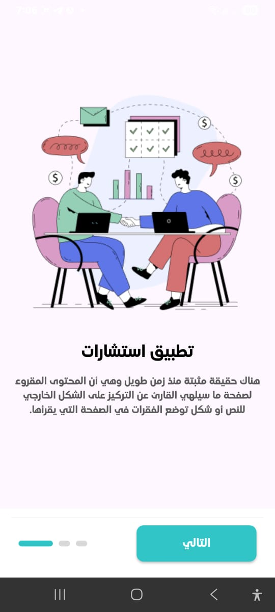
 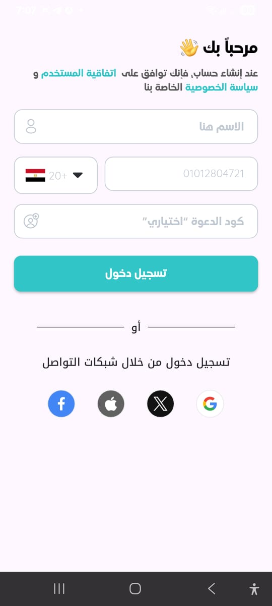
 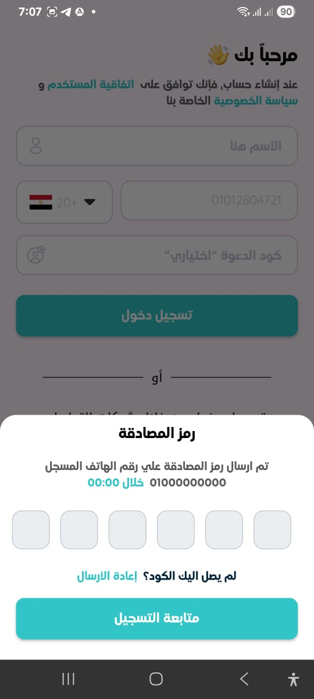
 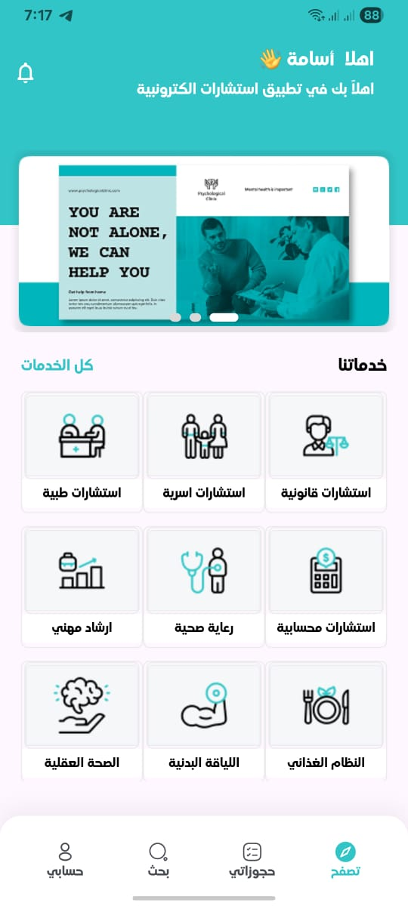
 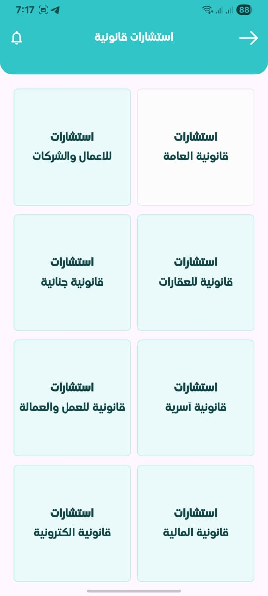
 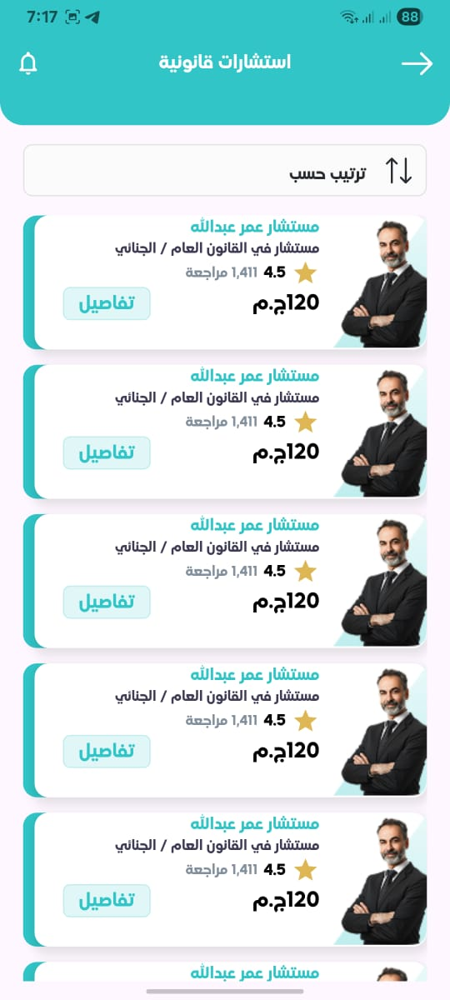
 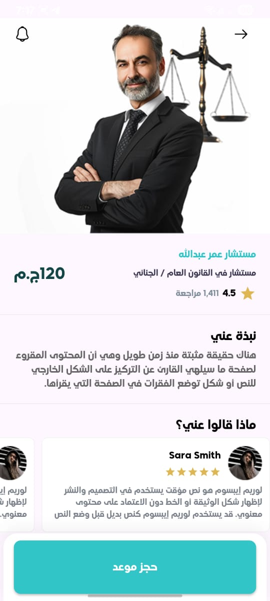
 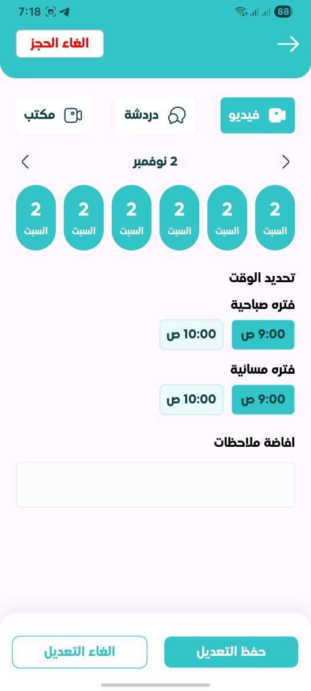
 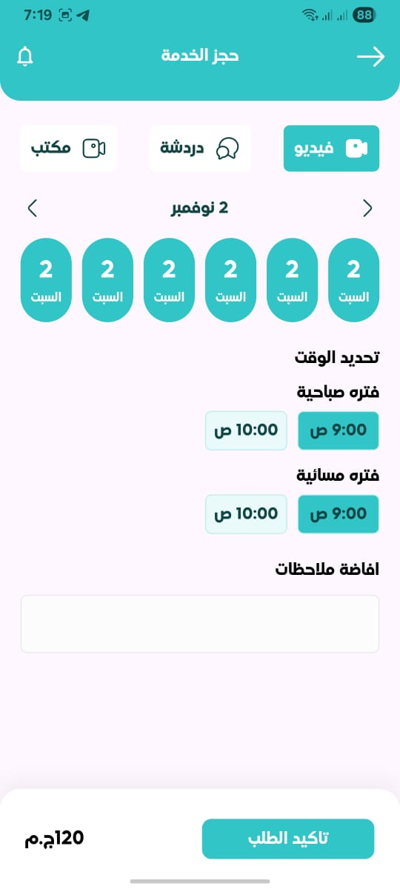
 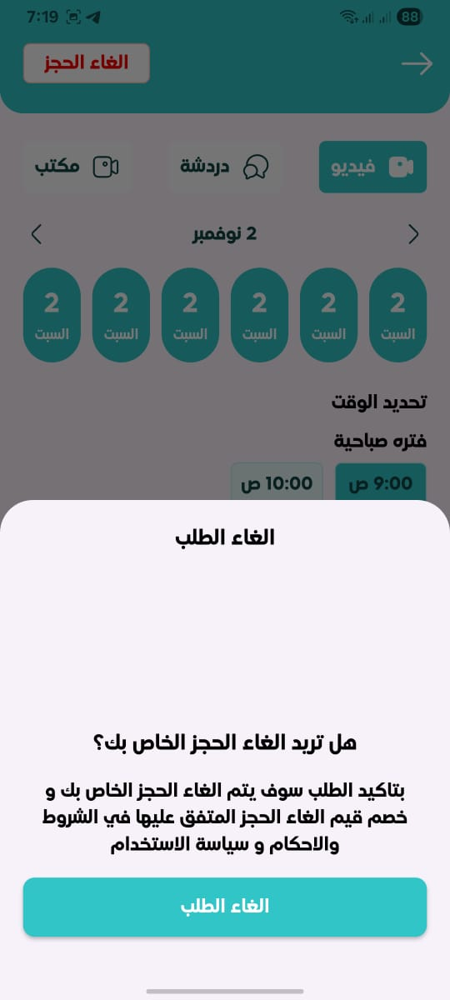
 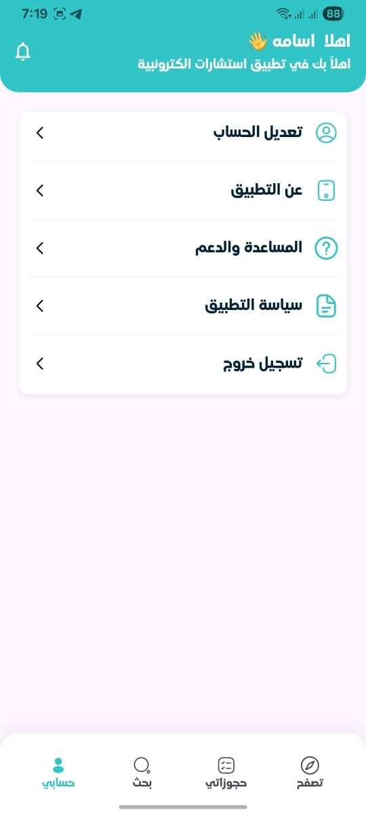
 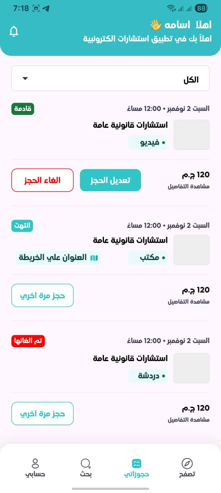
 
